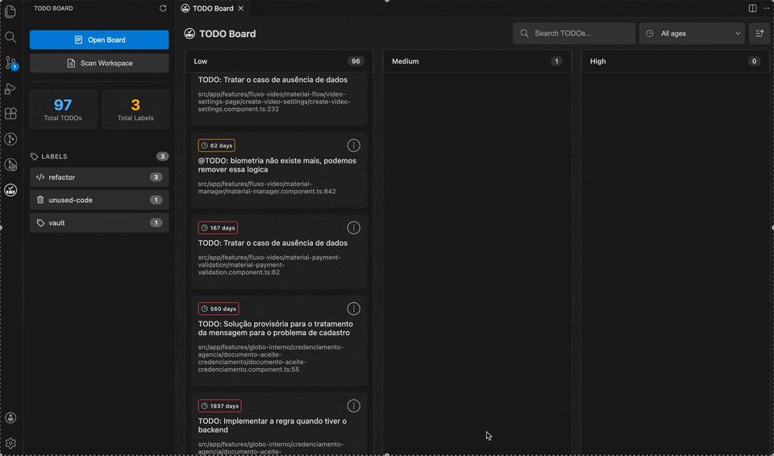
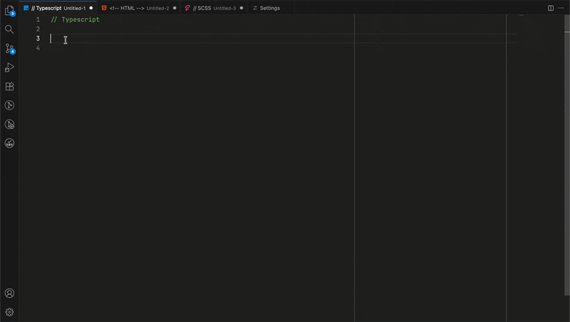

# Change Log

Todas as mudanças notáveis do "TODO Board" serão documentadas neste arquivo.

O formato é baseado em [Keep a Changelog](http://keepachangelog.com/).

## [1.4.1] - 2026-01-09

### 🔧 Melhorias Técnicas
Adicionando "TODO" aos padrões de busca para melhor compatibilidade entre projetos sem precisar atualizar nas configurações da extensão

## [1.4.0] - 2025-12-29

### ✨ Novas Funcionalidades

#### 🔗 Integração com Jira
- **Criação de Issues Direto do Board** - Crie issues no Jira a partir dos cards de TODO com autenticação OAuth 2.0 segura
  - Autenticação OAuth 2.0 (3LO) com modal explicativo
  - Armazenamento seguro de tokens no VS Code Secret Storage
  - Refresh automático de token em caso de expiração
  - Menu kebab em cada card com opções contextuais
  - Modal de criação com formulário de revisão
  - Seleção dinâmica de projetos acessíveis
  - Seleção de tipos de issue baseado no projeto
  - Inclusão automática de metadados (localização, prioridade, idade)
  - Badge visual com link para issue criada
  - Persistência de associações entre TODOs e issues

### 🔧 Melhorias Técnicas
- **Merge Inteligente** - Preserva associações de issues durante rescan
- **Filtro de Subtasks** - Remove subtasks da lista de tipos de issue
- **Data Attributes** - Cards incluem atributos para issue-id, issue-key, issue-link
- **Formatação de Idade** - Descrições de issues com idade formatada (hoje/1 dia/X dias)
- **Menu Contextual** - Opções dinâmicas baseadas em associação com issue
- **Docs** - Adicionando configurações do highlight ao readme

### 📋 Novos Comandos

| Comando | Descrição |
|---------|----------|
| `TODO Board: Connect to Jira` | Conecta com sua conta Jira |
| `TODO Board: Logout from Jira` | Desconecta da conta Jira |

## [1.3.0] - 2025-11-05

### ✨ Novas Funcionalidades

- **Destaque de TODOs no Editor** - Comentários TODO agora são destacados visualmente no código, é possível configurar e desativar nas configurações
  - Cores baseadas em prioridade:
    - 🔴 **Alta** (`@TODO(high)`) - Vermelho
    - 🟠 **Média** (`@TODO(medium)`) - Laranja
    - 🔵 **Baixa/Padrão** (`@TODO(low)` ou `@TODO`) - Azul
  - Configurável: ative/desative ou customize as cores
  - Funciona com todos os patterns de busca configurados
  - Atualização em tempo real conforme você digita
  - Indicadores na barra de rolagem (overview ruler)

### 🐛 Correções

- Corrigido detecção de labels em comentários de bloco (`/* */`, `/** */`)
- Melhorado regex de labels para capturar através de quebras de linha
- Adicionado suporte para TODOs dentro de blocos JSDoc

## [1.2.0] - 2025-11-04

### 🔧 Refatoração

- **Armazenamento Otimizado** - Migração do armazenamento de `.todo-board/` (no workspace) para o diretório de storage gerenciado pelo VS Code
  - Não polui mais o projeto do usuário
  - Storage isolado por workspace em `~/Library/Application Support/Code/User/workspaceStorage/{workspace-id}/`
  - Não é mais necessário adicionar `.todo-board` ao `.gitignore`
  - Melhor performance e segurança
  - Gerenciamento automático pelo VS Code

## [1.1.5] - 2025-11-04

**OBS: A pasta `.todo-board/` antiga pode ser removida manualmente**

## [1.1.5] - 2025-11-04

### 🎨 Melhorias

- Snippet para inserir comentário melhorado para outras linguagens.
- Melhorias no README para melhor entendimento das funcionalidades e gifs simplificados.

## [1.1.4] - 2025-11-03

### ✨ Novas Funcionalidades

#### 🕐 Sistema de Idade de TODOs
- **Visualização de Idade** - Mostra há quanto tempo cada TODO foi criado usando git blame
- **Cache Persistente** - Informações de idade armazenadas no storage do VS Code
- **Badges de Idade** - Indicadores visuais coloridos:
  - 🟢 Fresh (≤7 dias)
  - 🟡 Recent (≤30 dias)
  - 🟠 Old (≤90 dias)
  - 🔴 Abandoned (>90 dias)

#### 🔍 Sistema de Filtros e Ordenação
- **Filtro por Múltiplas Labels** - Selecione várias labels simultaneamente (lógica OR)
- **Filtro por Idade** - Dropdown para filtrar por categorias de idade
- **Ordenação por Data** - Toggle entre ordem ascendente/descendente
- **Visual de Labels Ativas** - Borda de destaque nas labels filtradas nos cards
- **Sincronização Sidebar** - Labels ativas destacadas na sidebar
- **Botão Reset** - Limpa todos os filtros e ordenação de uma vez (aparece apenas quando há filtros ativos)

### 🔧 Melhorias Técnicas
- **FilterState Service** - Gerenciamento centralizado de estado de filtros
- **Tipos TypeScript** - `AgeFilter`, `SortDirection`, `SortOptions`, `FilterOptions`
- **Utilitários de Filtro** - `filterTodos()`, `sortTodos()`, `filterAndSortTodos()`
- **Comunicação Webview** - Mensagens bidirecionais para sincronizar estado

## [1.0.4] - 2025-10-31

### 🎨 Melhorias Visuais

- Ícone e logo da extensão agora com fundo transparente real

## [1.0.3] - 2025-10-31

### 🎨 Melhorias Visuais

- Removida configuração de galleryBanner para usar comportamento padrão do Marketplace com ícone transparente

## [1.0.2] - 2025-10-31

### 🎨 Melhorias Visuais

- Ajuste na cor de fundo do banner no Marketplace para melhor contraste com o ícone

## [1.0.1] - 2025-10-30

### 🎨 Melhorias Visuais

- Ícones e logo da extensão aprimorados

## [1.0.0] - 2025-10-26

### 🎉 Lançamento Inicial

#### ✨ Funcionalidades

- **Quadro Kanban Visual** - Organize TODOs em colunas Low/Medium/High
- **Sistema de Prioridades** - Suporte para `low`, `medium`, `high` em formato `@TODO(priority)`
- **Sistema de Labels** - Tags customizadas com cores automáticas: `[refactor, bug, feature]`
- **Padrões de Busca Customizáveis** - Configure múltiplos padrões de busca (@TODO, TODO, FIXME, etc)
- **Sidebar Integrada** - Visualização rápida com estatísticas e contagem de labels
- **Inserção Rápida** - Comando com atalho `Cmd/Ctrl+Shift+T` para inserir TODOs
- **Cache Inteligente** - Reaproveitamento de resultados por mtime para performance
- **Filtro por Label** - Clique em labels para filtrar TODOs específicos

#### 🎨 Interface

- Ícones customizados para diferentes tipos de labels (bug, feature, refactor, etc)
- Cores automáticas para labels conhecidas
- Cards clicáveis que abrem o arquivo na linha correta
- Header com campo de busca e botão de limpar
- Design responsivo e moderno

#### ⚙️ Configurações

- `todo-board.searchPatterns` - Array de padrões customizáveis (padrão: `["@TODO"]`)
- `todo-board.fileExtensions` - Lista de extensões de arquivo para escanear
- `todo-board.maxTodoLines` - Número máximo de linhas por TODO (padrão: 4)

#### 🔧 Comandos

- `TODO Board: Scan @TODO` - Escaneia workspace por TODOs
- `TODO Board: Open Board` - Abre o quadro Kanban
- `TODO Board: Insert TODO Comment` - Insere snippet de TODO
- `TODO Board: Scan Workspace` - Rescaneia via sidebar

#### 📦 Otimizações

- Exclusões automáticas (node_modules, .git, dist, etc)
- Limite de 6000 linhas por arquivo
- Concorrência de 25 arquivos simultâneos
- Cache persistente no storage do VS Code

#### 🧪 Qualidade

- 158 testes automatizados
- Cobertura completa de utilitários e serviços
- Validação de regex patterns
- Testes de configuração e transformação

#### 📚 Documentação

- README completo com exemplos
- Guia de padrões de busca customizáveis
- 10+ exemplos de configuração
- Documentação técnica de implementação
