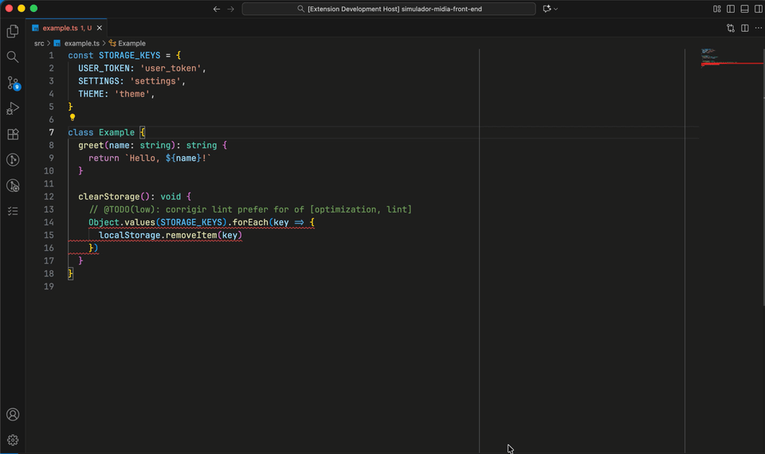

# TODO Board

[](https://marketplace.visualstudio.com/items?itemName=dantewebmaster.todo-board)
[](https://marketplace.visualstudio.com/items?itemName=dantewebmaster.todo-board)
[](https://marketplace.visualstudio.com/items?itemName=dantewebmaster.todo-board)
[](https://github.com/dantewebmaster/todo-board/blob/master/LICENSE)
[](https://github.com/dantewebmaster/todo-board)

Extensão do VS Code para localizar comentários `@TODO` no workspace e organizá-los em um quadro Kanban visual, com prioridades, labels e busca.

O diretório `.todo-board` é salvo no projeto para permitir versionamento e compartilhamento com o time de desenvolvimento, evitando a necessidade de reescanear toda vez que baixar o projeto.


## 📖 Índice

- [Funcionalidades](#-funcionalidades)
- [Demonstrações](#-demonstrações)
  - [Escaneando TODOs](#1-escaneando-todos)
  - [Visualizando o Board](#2-visualizando-o-board)
  - [Inserindo Comentários TODO](#3-inserindo-comentários-todo)
  - [Limpando Cache de Idade](#4-limpando-cache-de-idade)
- [Padrões de Busca Customizáveis](#-padrões-de-busca-customizáveis)
- [Configurações](#️-configurações)
- [Sistema de Labels](#-sistema-de-labels)
- [Performance](#-performance)
- [Desenvolvimento](#️-desenvolvimento)

## ✨ Funcionalidades

### 📊 Board Interativo
- Quadro Kanban visual com colunas Low/Medium/High
- Cards clicáveis que abrem o arquivo na linha correta
- Atualização automática ao escanear novos TODOs

### 🏷️ Sistema de Prioridades e Labels
- **Prioridades**: `low`, `medium`, `high` para Low, Medium, High
- **Labels**: Tags customizadas com cores
  - Exemplo: `@TODO(medium): [refactor, cleanup] Corrigir validação`
- Cores automáticas para labels comuns: bug, refactor, etc.

### 🔍 Busca Avançada
- Filtro instantâneo enquanto digita
- Busca em descrições, localizações e labels
- Atalho ESC para limpar
- Botão de limpar integrado

### 📁 Sidebar Integrada
- Visualização rápida de estatísticas
- Contagem total de TODOs
- Breakdown por labels
- Botões de ação rápida
- Ícone customizado na Activity Bar

## 🎬 Demonstrações

### 1. Escaneando TODOs

Escaneie todos os comentários TODO do seu workspace com um único comando. A extensão varre todos os arquivos configurados, identifica padrões de TODO e organiza os resultados por prioridade.


**Como usar:**
1. Abra o Command Palette (`Cmd+Shift+P` / `Ctrl+Shift+P`)
2. Digite e selecione `TODO Board: Scan @TODO`
3. Ou clique no botão "Scan TODOs" na sidebar
4. Aguarde a conclusão do escaneamento (com barra de progresso)

**O que acontece:**
- Varre recursivamente todos os arquivos do workspace
- Ignora pastas como `node_modules`, `.git`, `dist`, etc
- Identifica comentários com padrões configurados (`@TODO`, `FIXME`, etc)
- Extrai prioridades (`low`, `medium`, `high`) e labels (`[bug]`, `[refactor]`, etc)
- Salva resultados em `.todo-board/todos.json`
- Salva cache de idades de TODOs não commitados em `.todo-board/uncommitted-cache.json`
- Usa cache inteligente para não reprocessar arquivos inalterados

**Exemplo de comentários detectados:**
```typescript
// @TODO: Implementar validação de email
// @TODO(high): Corrigir bug crítico de autenticação
// @TODO(medium): [refactor, cleanup] Reorganizar código legacy
/*
 * @TODO(low): [docs] Adicionar documentação da API
 * Esta função precisa de exemplos mais claros
 */
```

---

### 2. Visualizando o Board

Abra o quadro Kanban visual e navegue pelos seus TODOs organizados por prioridade. Clique em qualquer card para ir direto ao arquivo e linha correspondente.



**Como usar:**
1. Abra o Command Palette (`Cmd+Shift+P` / `Ctrl+Shift+P`)
2. Digite e selecione `TODO Board: Open Board`
3. Ou clique no botão "Open TODO Board" na sidebar
4. Ou clique no ícone da extensão na Activity Bar

**Recursos do Board:**
- **3 colunas Kanban**: Low, Medium, High
- **Cards clicáveis**: Abrem o arquivo na linha exata do TODO
- **Busca em tempo real**: Filtre por descrição, arquivo ou label
- **Informações visuais**:
  - Labels com cores customizadas
  - Localização do arquivo (caminho relativo)
  - Número da linha
  - Descrição completa do TODO

**Exemplo de uso:**
1. Escanear TODOs primeiro (ver seção anterior)
2. Abrir o board
3. Visualizar todos os TODOs organizados
4. Clicar em um card para navegar ao código
5. Usar a busca para filtrar TODOs específicos

---

### 3. Inserindo Comentários TODO

Insira rapidamente comentários TODO formatados no estilo correto para cada linguagem, com suporte a prioridades e labels.


**Como usar:**
1. Posicione o cursor onde deseja inserir o TODO
2. Use o atalho `Cmd+Shift+T` (Mac) / `Ctrl+Shift+T` (Win/Linux)
3. Ou abra o Command Palette e selecione `TODO Board: Insert TODO Comment`
4. Preencha os campos do snippet

**Formatação automática por linguagem:**

**JavaScript/TypeScript:**
```javascript
// @TODO(${1|low,medium,high|}): ${2:description}
```

**Python:**
```python
# @TODO(${1|low,medium,high|}): ${2:description}
```

**HTML:**
```html
<!-- @TODO(${1|low,medium,high|}): ${2:description} -->
```

**CSS/SCSS:**
```css
/* @TODO(${1|low,medium,high|}): ${2:description} */
```

**Exemplo de workflow:**
1. Pressione `Cmd+Shift+T` no editor
2. Selecione a prioridade (low/medium/high) ou deixe em branco
3. Digite a descrição do TODO
4. Opcionalmente adicione labels: `[bug, refactor]`
5. Pressione Tab para confirmar

**Resultado:**
```typescript
// @TODO(high): [bug] Corrigir vazamento de memória na função processData
```

### 4. Limpando Cache de Idade

Limpe o cache de idades de TODOs não commitados para recalcular as datas baseadas no momento atual.

**Como usar:**
1. Abra o Command Palette (`Cmd+Shift+P` / `Ctrl+Shift+P`)
2. Digite e selecione `TODO Board: Clear Age Cache`
3. Confirme a mensagem de sucesso
4. Execute um novo scan para ver as datas atualizadas

**O que acontece:**
- Limpa o cache persistente (`.todo-board/uncommitted-cache.json`)
- Remove todas as datas armazenadas de TODOs não commitados
- TODOs em arquivos commitados não são afetados (mantêm a data do commit)
- No próximo scan, TODOs não commitados terão suas datas recalculadas baseadas no `mtime` do arquivo
- No próximo scan, TODOs não commitados terão suas idades recalculadas
- Útil quando você quer resetar as datas de TODOs antigos não commitados

**Quando usar:**
- Após commitar alterações e querer que as datas reflitam o novo commit
- Quando TODOs antigos não commitados precisam ser "resetados"
- Para limpar dados de cache que podem estar desatualizados

---

## 🔍 Padrões de Busca Customizáveis

A extensão suporta padrões customizáveis para encontrar diferentes tipos de comentários. Por padrão, busca por `@TODO`, mas você pode configurar para encontrar qualquer padrão desejado.

### Exemplos de Configuração

**1. Buscar por múltiplos padrões:**
```json
{
  "todo-board.searchPatterns": ["@TODO", "@FIXME", "@BUG"]
}
```
Encontrará comentários como:
```javascript
// @TODO: Implementar feature X
// @FIXME: Corrigir bug de performance
// @BUG: Validação quebrada no formulário
```

**2. Buscar sem o símbolo @:**
```json
{
  "todo-board.searchPatterns": ["TODO", "FIXME", "HACK"]
}
```
Útil para projetos com convenções diferentes:
```python
# TODO: Adicionar testes unitários
# FIXME: Resolver problema de encoding
# HACK: Solução temporária, refatorar depois
```

**3. Padrões personalizados:**
```json
{
  "todo-board.searchPatterns": ["URGENT", "REVIEW", "OPTIMIZE"]
}
```
Para marcadores customizados do seu time:
```typescript
// URGENT: Deploy bloqueado até resolver isso
// REVIEW: Código precisa de revisão antes do merge
// OPTIMIZE: Gargalo de performance identificado
```

### Regras dos Padrões

✅ **Suportado:**
- Padrões case-sensitive (diferenciam maiúsculas/minúsculas)
- Prioridades entre parênteses: `TODO(high)`, `FIXME(medium)`
- Labels entre colchetes: `TODO: [bug, critical]`
- Texto simples sem caracteres especiais

❌ **Não use:**
- Caracteres especiais de regex: `*`, `+`, `[`, `]`, `(`, `)`, `{`, `}`
- Use apenas texto simples

### Como Funciona

A extensão procura os padrões **no início dos comentários** (após os marcadores `//`, `#`, `/*`, `<!--`). Isso evita falsos positivos:

✅ **Detectado:**
```javascript
// TODO: Fazer isso        ← TODO no início
# FIXME: Corrigir aquilo   ← FIXME no início
/* BUG: Problema aqui */   ← BUG no início
```

❌ **Ignorado:**
```javascript
// Preciso finalizar os TODOS pendentes     ← TODOS no meio do texto
// Discussão sobre TODOs do projeto         ← TODOs não está no início
```

---

## ⚙️ Configurações

Configure a extensão através do `settings.json` do VS Code:

```json
{
  "todo-board.fileExtensions": [
    "html", "css", "scss", "sass", "less",
    "ts", "tsx", "js", "jsx", "mjs",
    "vue", "svelte", "astro",
    "md", "mdx",
    "json", "yaml", "yml",
    "java", "py", "go", "rb", "php",
    "c", "cpp", "h", "hpp",
    "rs", "swift", "kt"
  ],
  "todo-board.searchPatterns": ["@TODO"],
  "todo-board.maxTodoLines": 4
}
```

### Configurações Disponíveis

| Configuração | Tipo | Padrão | Descrição |
|-------------|------|--------|-----------|
| `todo-board.fileExtensions` | `string[]` | `["html", "css", "scss", ...]` | Lista de extensões de arquivo a serem escaneadas |
| `todo-board.searchPatterns` | `string[]` | `["@TODO"]` | Padrões customizáveis para busca de TODOs. Use apenas texto simples sem caracteres especiais de regex. |
| `todo-board.maxTodoLines` | `number` | `4` | Número máximo de linhas a coletar por TODO (útil para comentários multilinha) |

### Exemplos de Uso

**Escanear apenas arquivos TypeScript e JavaScript:**
```json
{
  "todo-board.fileExtensions": ["ts", "tsx", "js", "jsx"]
}
```

**Buscar múltiplos tipos de marcadores:**
```json
{
  "todo-board.searchPatterns": ["@TODO", "FIXME", "HACK", "XXX"]
}
```

**Coletar até 10 linhas por TODO (para comentários grandes):**
```json
{
  "todo-board.maxTodoLines": 10
}
```

---

## 🎨 Sistema de Labels

Organize seus TODOs com labels customizadas que aparecem com cores automáticas no board.

### Como Usar Labels

Adicione labels entre colchetes na descrição do TODO:

```typescript
// @TODO: [bug] Corrigir validação de formulário
// @TODO(high): [refactor, cleanup] Reorganizar módulo de autenticação
// @TODO(medium): [feature, ui] Adicionar modo escuro
// @TODO: [docs, api] Documentar endpoints da REST API
```

### Labels com Cores Automáticas

| Label | Cor | Ícone | Uso Recomendado |
|-------|-----|-------|-----------------|
| 🔴 **bug** | Vermelho | 🐛 | Bugs e correções |
| 🔴 **cleanup** | Vermelho | 🧹 | Limpeza de código |
| 🟢 **feature** | Verde | ✨ | Novas funcionalidades |
| � **refactor** | Azul | 🔄 | Refatoração de código |
| �🟡 **docs** | Âmbar | 📝 | Documentação |
| 🔵 **test** | Ciano | 🧪 | Testes e QA |
| 🩷 **security** | Rosa | 🔒 | Segurança |
| 🟣 **optimization** | Roxo | ⚡ | Otimizações |
| 🟣 **performance** | Roxo | 🚀 | Performance |
| 🔵 **ui** | Teal | 🎨 | Interface do usuário |
| 🔵 **ux** | Teal | 🎨 | Experiência do usuário |
| 🟠 **api** | Laranja | 🔌 | APIs e integrações |
| ⚫ **outros** | Cinza | 🏷️ | Labels customizadas |

### Múltiplas Labels

Você pode usar múltiplas labels separadas por vírgula:

```javascript
// @TODO(high): [bug, security, urgent] Corrigir vulnerabilidade XSS
// @TODO: [feature, api, docs] Criar endpoint de upload com documentação
// @TODO(medium): [refactor, test, cleanup] Reorganizar testes unitários
```

### Labels Customizadas

Você pode criar suas próprias labels - elas aparecerão com a cor cinza padrão:

```typescript
// @TODO: [backend] Implementar cache no servidor
// @TODO: [mobile] Adaptar layout para dispositivos móveis
// @TODO: [legacy] Migrar código antigo para nova arquitetura
```

Para customizar as cores, edite o arquivo `src/utils/label.ts`.

---

## ⚡ Performance

A extensão foi otimizada para lidar com workspaces grandes de forma eficiente:

- 🚀 **Varredura paralela** - Processa múltiplos arquivos simultaneamente com workers
- 💾 **Cache inteligente** - Usa mtime (modification time) para evitar reprocessar arquivos inalterados
- 🚫 **Exclusões automáticas** - Ignora pastas pesadas automaticamente:
  - `node_modules`, `.git`, `dist`, `out`, `build`
  - `coverage`, `.cache`, `tmp`, `.angular`
  - Arquivos de lock: `package-lock.json`, `yarn.lock`, `pnpm-lock.yaml`
- 🎯 **Filtros configuráveis** - Escaneie apenas as extensões que você precisa
- 📊 **Progresso incremental** - Barra de progresso em tempo real com opção de cancelamento
- ⚡ **Atualização em tempo real** - Board atualiza instantaneamente após escanear

### Benchmarks

Em um workspace típico:
- **10.000 arquivos**: ~5-10 segundos (primeiro scan)
- **10.000 arquivos**: ~1-2 segundos (scans subsequentes com cache)
- **Memória**: ~50-100MB durante escaneamento

---

## 🛠️ Desenvolvimento

### Pré-requisitos

- Node.js >= 18
- VS Code >= 1.85.0

### Setup do Projeto

```bash
# Clonar repositório
git clone https://github.com/dantewebmaster/todo-board.git
cd todo-board

# Instalar dependências
npm install

# Compilar TypeScript
npm run compile
```

### Scripts Disponíveis

```bash
npm run compile      # Compilar TypeScript uma vez
npm run watch        # Assistir mudanças e recompilar automaticamente
npm run lint         # Verificar código com ESLint
npm test            # Executar todos os testes (158 testes)
npm run pretest     # Compilar e executar lint antes dos testes
```

### Estrutura do Código

```
src/
├── __tests__/                    # 📝 Testes automatizados (158 testes ✅)
│   ├── commands/                 # Testes de comandos
│   ├── config/                   # Testes de configuração
│   ├── constants/                # Testes de constantes e regex
│   ├── services/                 # Testes de serviços
│   ├── utils/                    # Testes de utilitários
│   └── extension.test.ts         # Testes da extensão principal
├── commands/                     # 🎮 Comandos da extensão
│   ├── filter-by-label.ts        # Filtrar por label
│   ├── insert-todo.ts            # Inserir comentário TODO
│   ├── open-board.ts             # Abrir board Kanban
│   └── scan-todos.ts             # Escanear workspace
├── config/                       # ⚙️ Configurações
│   └── index.ts                  # Getters de configuração
├── constants/                    # 📋 Constantes
│   └── regex.ts                  # Padrões regex
├── services/                     # 🔧 Serviços principais
│   ├── cache.ts                  # Sistema de cache (mtime)
│   ├── filter-state.ts           # Estado de filtros
│   ├── persist.ts                # Persistência de dados
│   └── scanner.ts                # Scanner de comentários
├── types/                        # 📐 TypeScript types
│   ├── cache.ts                  # Tipos de cache
│   └── todo.ts                   # Tipos de TODO
├── ui/                           # 🎨 Interface do usuário
│   ├── board/                    # Webview do board
│   │   ├── index.ts              # Renderização
│   │   ├── scripts.ts            # JavaScript da webview
│   │   ├── styles.ts             # CSS do board
│   │   ├── components/           # Componentes do board
│   │   │   ├── board-card.ts     # Card de TODO
│   │   │   ├── board-column.ts   # Coluna Kanban
│   │   │   └── header.ts         # Header com busca
│   │   └── services/
│   │       └── board-transformer.ts  # Transformação de dados
│   ├── icons/                    # Ícones SVG
│   │   └── index.ts
│   └── sidebar/                  # Webview da sidebar
│       ├── index.ts              # Renderização
│       ├── scripts.ts            # JavaScript da sidebar
│       ├── styles.ts             # CSS da sidebar
│       ├── components/
│       │   └── labels-list.ts    # Lista de labels
│       └── providers/
│           └── render-sidebar.ts # Provider da sidebar
├── utils/                        # 🛠️ Utilitários
│   ├── generators.ts             # Geração de IDs e nonces
│   ├── label.ts                  # Processamento de labels
│   ├── priority.ts               # Parsing de prioridades
│   ├── regex-builder.ts          # Construção de regex dinâmicos
│   └── sanitize.ts               # Sanitização de HTML
└── extension.ts                  # 🚀 Entry point
```

### Debug e Testes

**Testar a extensão:**
1. Pressione `F5` no VS Code para abrir uma nova janela de desenvolvimento
2. Na janela de desenvolvimento, execute os comandos da extensão
3. Verifique o console de debug para logs

**Executar testes:**
```bash
npm test                          # Todos os testes
npm test -- --grep "scanner"     # Apenas testes do scanner
npm test -- --grep "config"      # Apenas testes de config
```

### Contribuindo

Contribuições são muito bem-vindas! 🎉

**Como contribuir:**
1. Fork o repositório
2. Crie uma branch para sua feature (`git checkout -b feature/amazing-feature`)
3. Faça commit das mudanças (`git commit -m 'Add: amazing feature'`)
4. Push para a branch (`git push origin feature/amazing-feature`)
5. Abra um Pull Request

**Guidelines:**
- Siga as boas práticas do Clean Code
- Mantenha o código tipado (TypeScript)
- Adicione testes para novas funcionalidades
- Execute `npm run lint` antes de commitar
- Escreva mensagens de commit claras e descritivas

---

## 📋 Roadmap

### ✅ Concluído (v1.0.0)
- [x] Comando para escanear TODOs no workspace
- [x] Persistência em `.todo-board/todos.json`
- [x] Exclusões inteligentes automáticas
- [x] Otimizações de performance (cache, concorrência)
- [x] Filtro por extensões configuráveis
- [x] Barra de progresso com cancelamento
- [x] Interface Webview Kanban (Low/Medium/High)
- [x] Sistema de prioridades e labels
- [x] Sidebar com estatísticas
- [x] Padrões de busca customizáveis
- [x] Ícones customizados
- [x] 158 testes automatizados

### 🔮 Planejado (v1.1.0+)
- [ ] Limpeza automática do cache
- [ ] Watcher para atualizações incrementais
- [ ] Remover comentário ao marcar como concluído/cancelado
- [ ] Filtros avançados (por arquivo, data)
- [ ] Integração com GitHub/Gitlab Issues
- [ ] Estatísticas e gráficos de progresso

---

## 🤝 Contribuindo

Contribuições são muito bem-vindas! Veja a seção [Desenvolvimento](#️-desenvolvimento) para mais detalhes.

**Maneiras de contribuir:**
- 🐛 Reportar bugs através das [Issues](https://github.com/dantewebmaster/todo-board/issues)
- 💡 Sugerir novas funcionalidades
- 📝 Melhorar a documentação
- 🔧 Enviar Pull Requests
- ⭐ Dar uma estrela no repositório

---

## 📄 Licença

MIT © [Dante Roberio](https://github.com/dantewebmaster)

Veja o arquivo [LICENSE](./LICENSE) para mais detalhes.

---

## 🙏 Agradecimentos

- Comunidade VS Code pela excelente documentação
- Você, por usar o TODO Board! 🎉

---

<div align="center">

**Desenvolvido com ❤️ para melhorar a gestão de TODOs no VS Code**

[⬆ Voltar ao topo](#todo-board)

</div>
