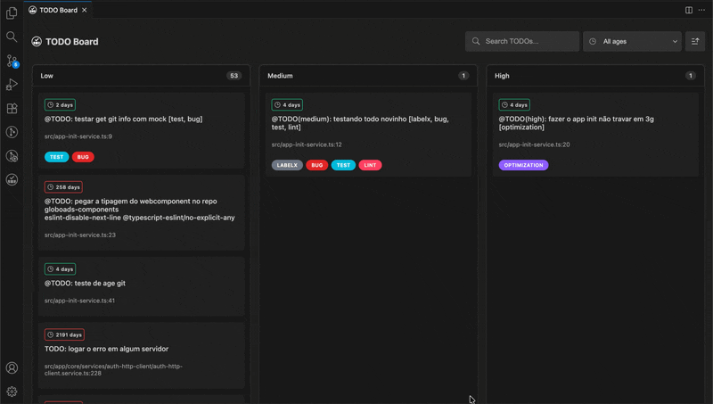
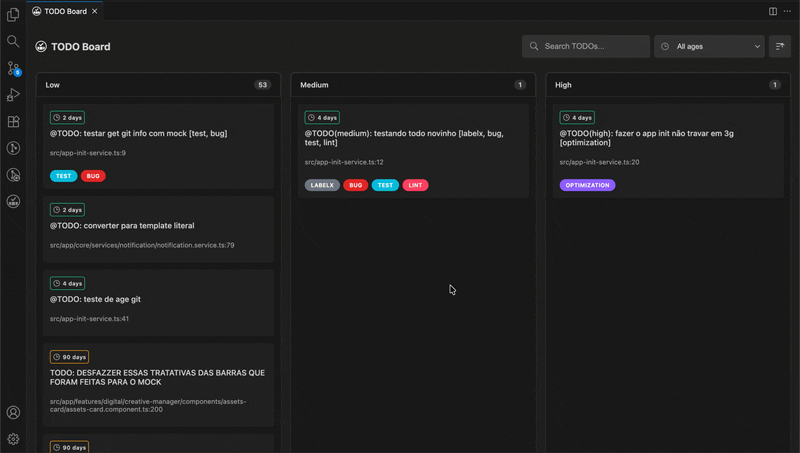
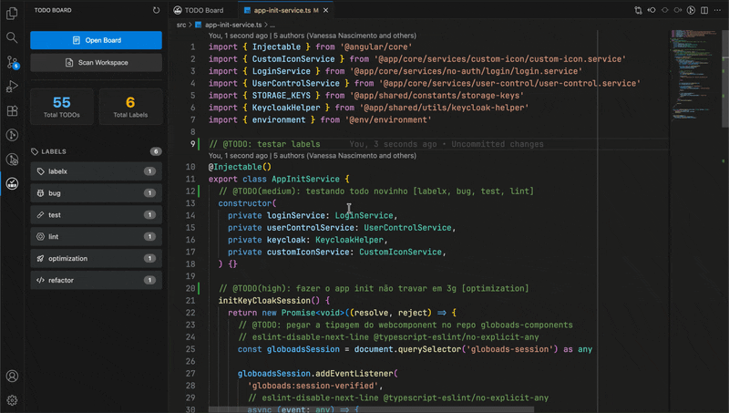
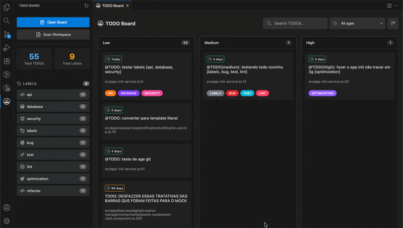
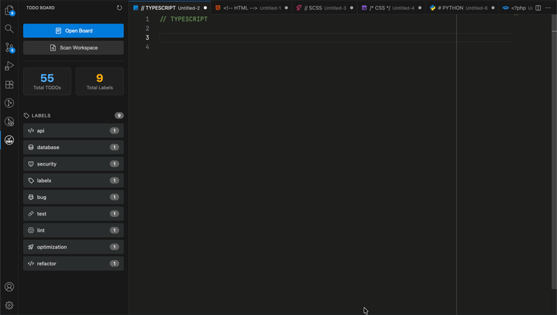
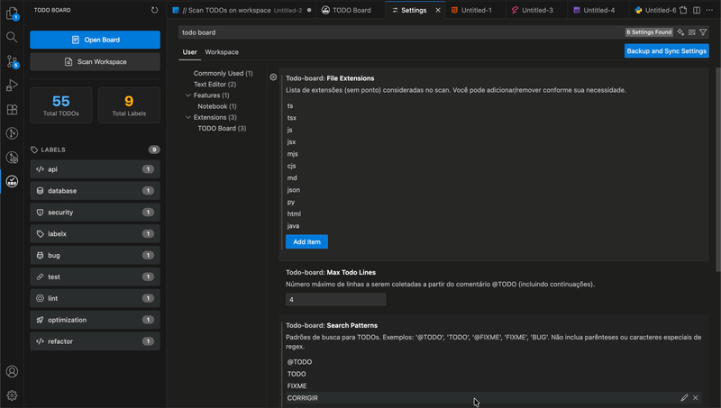

<div align="center">

# TODO Board

[](https://marketplace.visualstudio.com/items?itemName=dantewebmaster.todo-board)
[](https://marketplace.visualstudio.com/items?itemName=dantewebmaster.todo-board)
[](https://marketplace.visualstudio.com/items?itemName=dantewebmaster.todo-board)
[](https://github.com/dantewebmaster/todo-board/blob/master/LICENSE)


**Faça um scan automático no seu workspace. Organize seus TODOs em um quadro Kanban visual com prioridades, labels, filtros, texto e rastreamento de idade, destaque visual em comentários com 'TODO' e agora com integração para criar issue no Jira direto pelo card**

[Instalação](#-instalação) • [Funcionalidades](#-funcionalidades) • [Uso Rápido](#-uso-rápido) • [Configuração](#️-configuração) • [Contribuir](./CONTRIBUTING.md)

</div>

---

## 🚀 Instalação

1. Abra o VS Code
2. Vá em Extensions (`Cmd+Shift+X` / `Ctrl+Shift+X`)
3. Busque por **"TODO Board"**
4. Clique em **Install**

Ou instale diretamente: [VS Code Marketplace](https://marketplace.visualstudio.com/items?itemName=dantewebmaster.todo-board)

## ✨ Funcionalidades

### 📊 Quadro Kanban Visual

Visualize todos os seus TODOs organizados em um quadro Kanban com 3 colunas de prioridade:
- **High**: Tarefas urgentes e críticas
- **Medium**: Tarefas importantes mas não urgentes
- **Low**: Tarefas de baixa prioridade

Os cards são clicáveis e abrem o arquivo diretamente na linha exata do TODO.



---

### 🕐 Rastreamento de Idade

Acompanhe há quanto tempo cada TODO foi criado e identifique tarefas esquecidas:

- 🟢 **Fresh** (≤7 dias) - TODOs recém-criados
- 🟡 **Recent** (≤30 dias) - TODOs do último mês
- 🟠 **Old** (≤90 dias) - TODOs antigos que precisam atenção
- 🔴 **Abandoned** (>90 dias) - TODOs abandonados


---

### 🔍 Filtros Avançados

Sistema completo de filtros para encontrar exatamente o que você precisa:

- **Filtro por Texto**: Encontre rapidamente TODOs com base em texto digitado
- **Filtro por Labels**: Selecione múltiplas labels simultaneamente
- **Filtro por Idade**: Filtre por categoria de tempo
- **Ordenação**: Organize por data de criação ou prioridade
- **Indicadores Visuais**: Veja filtros ativos com botão de reset rápido



---

### 🏷️ Labels Customizadas

Categorize seus TODOs com labels inteligentes que incluem cores e ícones automáticos. Existem labels predefinidas, porém é possível nomear a vontade suas próprias labels:

#### Lista de labels predefinidas:
- refactor
- bug
- feature
- cleanup
- docs
- ui
- ux
- database
- api
- security
- performance
- lint
- dead-code
- unused-code
- docs
- test
- improvement
- optimization
- config

Você pode usar labels customizadas no formato: `@TODO: [labe1, label2] descrição`



---

### 🔗 Integração com Jira

Crie issues no Jira diretamente do board, mantendo sincronização perfeita entre seus TODOs e o gerenciamento de projetos:

- **Autenticação OAuth 2.0**: Conexão segura com modal explicativo do processo
- **Menu Kebab**: Acesse opções contextuais em cada card
- **Criação de Issues**: Modal com formulário de revisão e campos customizáveis
- **Seleção Dinâmica**: Escolha entre seus projetos e tipos de issue disponíveis
- **Metadados Automáticos**: Localização do arquivo, prioridade e idade incluídos na descrição
- **Badge com Link**: Visualize e acesse a issue criada diretamente do card
- **Persistência**: Associações mantidas entre rescans
- **Refresh Automático**: Token atualizado automaticamente em caso de expiração


#### Configuração para Ambientes Corporativos
Se sua empresa restringe OAuth apps, peça ao administrador Jira para:

1. Acessar: **Jira Settings** → **Security** → **OAuth 2.0 (3LO) apps**
2. Clicar em **"Add approved app"**
3. Adicionar o Client ID: `4WRKzqlFEaHBQYAZyyI9VgjZ8w5dxa5F`
4. Salvar

#### Ou outra forma mais prática de permitir o app:
Acessar a [Url de autorização](https://todo-board.dantewebmaster.com.br/oauth/start) do app exibirá a tela de autorização, ao aceitar o admin irá permitir a instalação por outros usuários.

Após aprovação, todos os usuários poderão conectar a extensão.

#### Como usar:

1. **Autenticar**: `Cmd/Ctrl + Shift + P` → **"TODO Board: Authenticate with Jira"**
2. **Criar Issue**: Clique no menu kebab (⋮) no card → **"Criar issue no Jira"**
3. **Preencher Formulário**: Selecione projeto, tipo e revise os dados
4. **Acessar Issue**: Clique na badge da issue para abrir no navegador

---

### 🎨 Highlight de TODOs no Editor

Destaque visual de TODOs diretamente no código com cores baseadas em prioridade e com configuração adiconal para customizar cores ou desativar:

- **🔴 High Priority**: Destaque em vermelho para tarefas urgentes
- **🟠 Medium Priority**: Destaque em laranja para tarefas importantes
- **🔵 Low Priority**: Destaque em azul para tarefas de baixa prioridade

O highlight funciona com comentários de linha única (`//`, `#`) e blocos (`/* */`, `/** */`), respeitando a configuração de `maxTodoLines` para limitar quantas linhas são destacadas.


---

### 📊 Sidebar Integrada

Painel lateral com visão geral completa do seu workspace:

- **Estatísticas em Tempo Real**: Total de TODOs, distribuição por prioridade
- **Filtro Rápido por Label**: Clique para filtrar instantaneamente
- **Sincronização Visual**: Atualizações automáticas com o quadro principal



---

### ⌨️ Inserção Rápida de TODOs

Insira TODOs formatados automaticamente com um único atalho (`Cmd/Ctrl+Shift+T`) ou usando comando **TODO board Insert TODO Comment**:

- Detecta automaticamente a linguagem do arquivo
- Usa o formato de comentário correto
- Permite adicionar prioridade e labels interativamente



## 📖 Uso Rápido

### Escanear Workspace

`Cmd/Ctrl + Shift + P` → **"TODO Board: Scan @TODO"**.
O primeiro scan levará alguns segundos, os próximos serão praticamente instantâneos.

### Abrir Board

`Cmd/Ctrl + Shift + P` → **"TODO Board: Open Board"**.
Ou clique no ícone na Activity Bar.

### Inserir TODO Comment

`Cmd/Ctrl + Shift + P` → **"TODO Board: Insert TODO Comment"**

## ⚙️ Configuração



```json
{
  // Extensões de arquivo para escanear
  "todo-board.fileExtensions": [
    "ts", "tsx", "js", "jsx", "vue", "py", "go", "rb", "php", "rs", "swift"
  ],

  // Padrões de busca customizáveis
  "todo-board.searchPatterns": ["@TODO", "FIXME", "BUG"],

  // Máximo de linhas por TODO
  "todo-board.maxTodoLines": 4,

  // Highlight de TODOs no editor
  "todo-board.highlight.enabled": true,
  "todo-board.highlight.highPriorityColor": "#e74c3c",
  "todo-board.highlight.mediumPriorityColor": "#ffa94d",
  "todo-board.highlight.lowPriorityColor": "#4dabf7"
}
```

## ⚡ Performance

- 🚀 Cache inteligente baseado em `mtime`
- 🔄 Processamento paralelo de arquivos
- 🚫 Exclusões automáticas: `node_modules`, `.git`, `dist`, etc
- 📊 **10.000 arquivos**: ~5-10s (primeiro scan), ~1-2s (com cache)

## 📋 Comandos

| Comando | Atalho | Descrição |
|---------|--------|-----------|
| `TODO Board: Scan @TODO` | - | Escaneia workspace |
| `TODO Board: Open Board` | - | Abre quadro Kanban |
| `TODO Board: Insert TODO Comment` | `Cmd/Ctrl+Shift+T` | Insere TODO formatado |
| `TODO Board: Clear Age Cache` | - | Limpa cache de idades || `TODO Board: Connect to Jira` | - | Conecta com sua conta Jira |
| `TODO Board: Logout from Jira` | - | Desconecta da conta Jira |
## 🤝 Contribuindo

Contribuições são bem-vindas! Veja o [guia de contribuição](./CONTRIBUTING.md).

- 🐛 [Reportar bugs](https://github.com/dantewebmaster/todo-board/issues)
- 💡 Sugerir features
- 📝 Melhorar documentação
- ⭐ Dar estrela no repositório

## 📄 Licença

MIT © [Dante Roberio](https://github.com/dantewebmaster)

---

<div align="center">

**[📋 Changelog](./CHANGELOG.md)** • **[🤝 Contribuir](./CONTRIBUTING.md)** • **[📝 Licença](./LICENSE)**

Desenvolvido com ❤️ para melhorar a gestão de TODOs no VS Code

</div>
